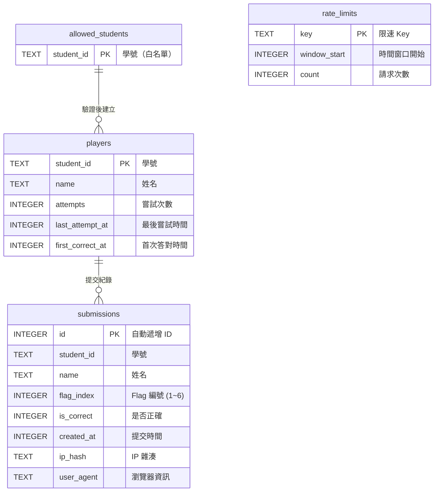

# 資料庫架構說明

本專案使用 **Cloudflare D1**（SQLite 相容的 Serverless 資料庫）作為後端資料儲存。

---

## 資料庫配置

| 項目 | 值 |
|------|-----|
| 資料庫名稱 | `polyglot-ctf` |
| Binding 名稱 | `DB` |
| 資料庫類型 | Cloudflare D1 (SQLite) |

---

## ER 圖（實體關係圖）



---

## 資料表詳細說明

### 1. `allowed_students` - 白名單

控制哪些學號可以參與 CTF 挑戰。

| 欄位 | 類型 | 約束 | 說明 |
|------|------|------|------|
| `student_id` | TEXT | PRIMARY KEY | 學號，格式為 `C` + 9 位數字（如 `C111151142`） |

**備註**：可透過環境變數 `WHITELIST_ENABLED=0` 關閉白名單限制。

---

### 2. `players` - 玩家資訊

記錄每位參與者的基本資訊與嘗試統計。

| 欄位 | 類型 | 約束 | 說明 |
|------|------|------|------|
| `student_id` | TEXT | PRIMARY KEY | 學號 |
| `name` | TEXT | NOT NULL | 姓名（目前系統使用學號作為姓名） |
| `attempts` | INTEGER | NOT NULL, DEFAULT 0 | 總嘗試次數 |
| `last_attempt_at` | INTEGER | NOT NULL | 最後一次嘗試的 Unix 時間戳 |
| `first_correct_at` | INTEGER | NULL | 首次答對任一 Flag 的 Unix 時間戳 |

**索引**：
- `idx_players_first_correct_at` - 用於排行榜排序查詢

---

### 3. `submissions` - 提交紀錄

記錄所有**正確**的 Flag 提交。

| 欄位 | 類型 | 約束 | 說明 |
|------|------|------|------|
| `id` | INTEGER | PRIMARY KEY AUTOINCREMENT | 自動遞增 ID |
| `student_id` | TEXT | NOT NULL | 提交者學號 |
| `name` | TEXT | NOT NULL | 提交者姓名 |
| `flag_index` | INTEGER | NOT NULL | Flag 編號（1~3 主線，4~6 支線） |
| `is_correct` | INTEGER | NOT NULL | 是否正確（固定為 1） |
| `created_at` | INTEGER | NOT NULL | 提交時間（Unix 時間戳） |
| `ip_hash` | TEXT | NULL | 提交者 IP 雜湊（隱私保護） |
| `user_agent` | TEXT | NULL | 瀏覽器 User-Agent |

**約束**：
- `UNIQUE(student_id, flag_index)` - 每位學生每個 Flag 只能成功提交一次

**索引**：
- `idx_submissions_student_created` - 加速學生提交紀錄查詢

**設計說明**：
- 為避免 Flag 答案外洩，資料庫**不儲存 Flag 原文**，僅記錄 `flag_index`
- 錯誤的提交不會寫入此表（防止被刷爆）

---

### 4. `rate_limits` - 限速控制

實作固定時間窗口的 API 限速機制。

| 欄位 | 類型 | 約束 | 說明 |
|------|------|------|------|
| `key` | TEXT | PRIMARY KEY | 限速識別 Key（如 `ip:1.2.3.4` 或 `sid:C111151142`） |
| `window_start` | INTEGER | NOT NULL | 時間窗口開始（秒級 Unix 時間戳，每分鐘一個窗口） |
| `count` | INTEGER | NOT NULL | 該窗口內的請求次數 |

**限速規則**：
- 預設每分鐘最多 5 次提交（可透過 `RATE_LIMIT_PER_MIN` 環境變數調整）
- 同時對 IP 和學號進行限速，雙重保護

---

## 環境變數（Secrets）

Flag 答案存放於 Cloudflare 環境變數中，**不存在資料庫內**。

| 變數名稱 | 必填 | 說明 |
|---------|------|------|
| `FLAG1` | ✅ | 主線第一關答案（PNG 圖片隱寫） |
| `FLAG2` | ✅ | 主線第二關答案（TXT 加密文字） |
| `FLAG3` | ✅ | 主線第三關答案（MP3 頻譜分析） |
| `FLAG4` | ❌ | 支線第四關答案（可選） |
| `FLAG5` | ❌ | 支線第五關答案（可選） |
| `FLAG6` | ❌ | 支線第六關答案（可選） |
| `WHITELIST_ENABLED` | ❌ | 白名單開關（預設啟用，設為 `0` 關閉） |
| `RATE_LIMIT_PER_MIN` | ❌ | 每分鐘提交限制（預設 5 次） |
| `ALLOWED_ORIGINS` | ❌ | 允許的跨域來源（逗號分隔） |

---

## 資料庫遷移紀錄

| 編號 | 檔案 | 日期 | 說明 |
|------|------|------|------|
| 0001 | `0001_init.sql` | 2025-12-18 | 初始化資料表結構 |
| 0002 | `0002_submissions_per_flag.sql` | 2025-12-19 | 重構 submissions 表，改為 per-flag 記錄 |

---

## 常用管理指令

```powershell
# 查看所有白名單學號
wrangler d1 execute polyglot-ctf --remote --command "SELECT * FROM allowed_students;"

# 新增白名單學號
wrangler d1 execute polyglot-ctf --remote --command "INSERT INTO allowed_students(student_id) VALUES ('C111151142');"

# 刪除白名單學號
wrangler d1 execute polyglot-ctf --remote --command "DELETE FROM allowed_students WHERE student_id='C111151142';"

# 查看排行榜（已答對的提交）
wrangler d1 execute polyglot-ctf --remote --command "SELECT student_id, flag_index, datetime(created_at, 'unixepoch', '+8 hours') as time FROM submissions WHERE is_correct=1 ORDER BY created_at;"

# 查看玩家統計
wrangler d1 execute polyglot-ctf --remote --command "SELECT * FROM players ORDER BY first_correct_at;"

# 清空限速紀錄（如需重置）
wrangler d1 execute polyglot-ctf --remote --command "DELETE FROM rate_limits;"
```

---

## 安全設計

1. **Flag 不存資料庫** - 答案存於環境變數，即使資料庫外洩也不會洩漏答案
2. **白名單機制** - 僅允許指定學號參與
3. **雙重限速** - 同時限制 IP 和學號的提交頻率
4. **唯一約束** - 防止重複提交同一個 Flag
5. **Origin 驗證** - 防止跨站請求偽造（CSRF）
